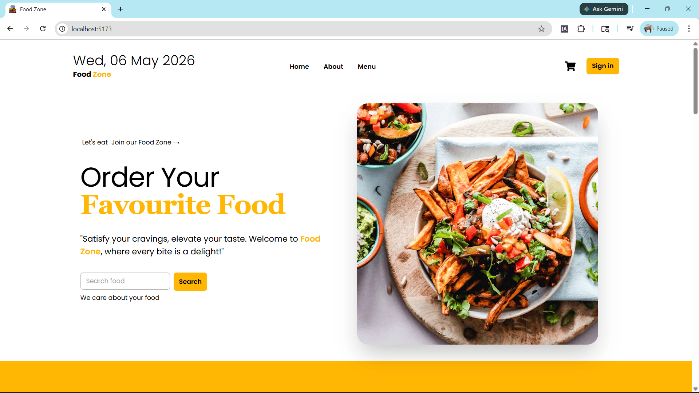
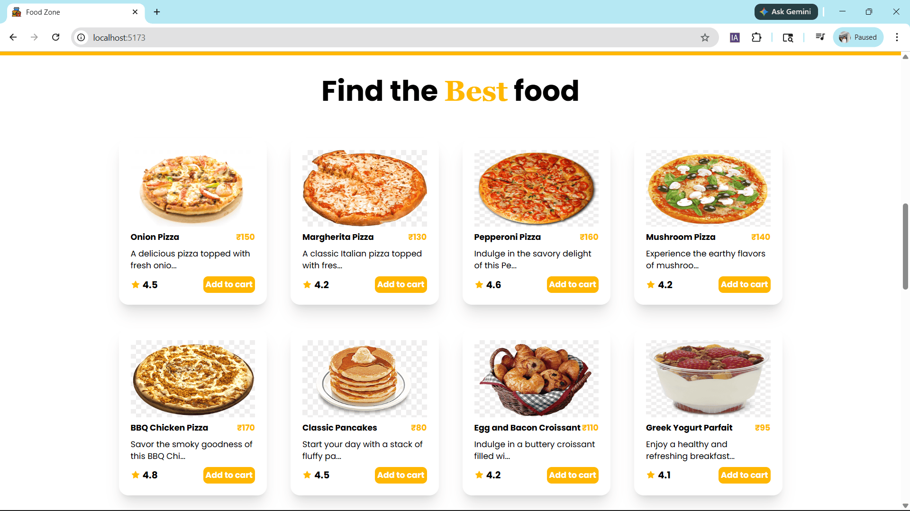
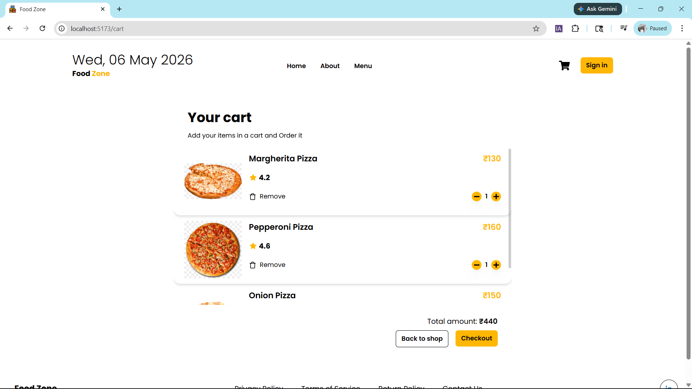

# 🍔 Food-Zone Enhanced

A modern and visually stunning **Food Delivery UI Web App** inspired by Swiggy & Zomato.  
This project focuses on **premium UI, smooth UX, and real-world features**.

---

## 🚀 Live Demo
👉 https://food-zone-enhanced.vercel.app/

---

## 📸 Screenshots

### 🏠 Home Page


### 🍕 Menu Page


### 🛒 Cart Page


### 📱 Mobile View


---

## ✨ Features

- 🔍 Search Food Items (Live filtering)
- 🛒 Smart Cart System (Add/Remove Items)
- 📊 Auto Price Calculation
- 📱 Fully Responsive Design
- 🎨 Modern UI with Tailwind CSS
- ⚡ Fast Performance with Vite
- 💼 Clean & Professional Layout
- 🔗 LinkedIn Footer Integration

---

## 🛠️ Tech Stack

- ⚛️ React.js
- 🎨 Tailwind CSS
- 🧠 Redux Toolkit
- ⚡ Vite

---

## 📦 Installation

```bash
git clone https://github.com/YOUR_USERNAME/Food-Zone-Enhanced.git
cd Food-Zone-Enhanced
npm install
npm run dev